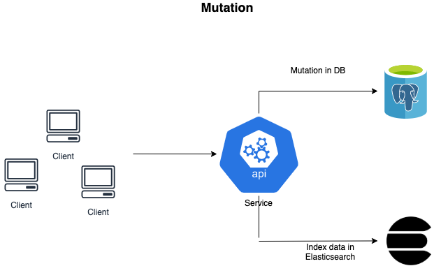
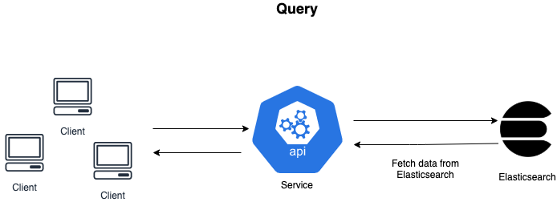

### XRides-service

This is the API service layer for XRides, this service can be used to send XRides data to your system as well as execute dsl queries by leveraging the power of elasticsearch, with which we can also perform analytics operations on the data.

The service is designed, keeping in mind the real-time streaming nature of data and the burst of requests at peak times of the day.

## Architecture used

## How to run

1. Go to the directory create the infrastructure needed and start the machines using `docker-compose up`.

2. Run the Postgres migrations needed  `cd xrides && docker-compose run web python manage.py migrate`.

3. Create index in elasticsearch  `cd xrides && docker-compose run web python manage.py search_index --create`. This step will be ignored. elasticsearch will create an index when needed anyways.

4. Now the web application is accessible at `http://localhost:8000`

5. You should be able to see CRUD operation APIs at `http://localhost:8000/api/` pointing to the  postgres and ES backend

## Endpoints

1 `add-booking`, this endpoint is can be tested with`test-script.py` file present [here](xrides/test_scripts/test_script_1.py)

2 `delete-booking`, this endpoint can be used for deletion of booking using the booking id.

3 `bookings`, this endpoint is the entry point for all queries, the queries are performed using elasticsearch, the `booking` endpoint will List the Bookings.

4 `bookings/?id=BOOKING_ID`, this will perform a lookup for the BOOKING_ID data.

5 `booking/?search=BOOKING_ID||USER_ID`, this will perform a search on the user_id as well as booking_id

Note: all these endpoints will be available through the `/api` endpoint, i.e if hosted locally, the endpoint for adding a booking wll be `http://localhost:8000/api/add-booking`

## Accomplishments:

- [*] django with postgres
- [*] CRUD operations - using Restful webservices.
- [*] elasticsearch implementation
- [*] updating elasticsearch as we make changes in postgres db
- [*] Django style search API with elasticsearch backend.
- [*] Dockerizing the application

## Scaling

This service can be scaled using [Kubernetes](https://kubernetes.io/), the dockerized image can be deploy as a pod in kubernetes and further the pods can be scaled using [Horizontal pod autoscaler](https://kubernetes.io/docs/tasks/run-application/horizontal-pod-autoscale/) which can be used in combination with a [cluster autoscaler](https://github.com/kubernetes/autoscaler) in order to achieve an infinite scaling of this service, i.e adding more and more nodes to the cluster will automatically scale the service as per the requirement.

## Todos

- [*] Improve the ES Indexes
- [*] Add update APIs
- [*] Add more queries API using ES
- [*] Use kibana logstash for analytics

